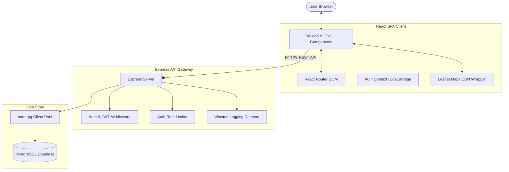
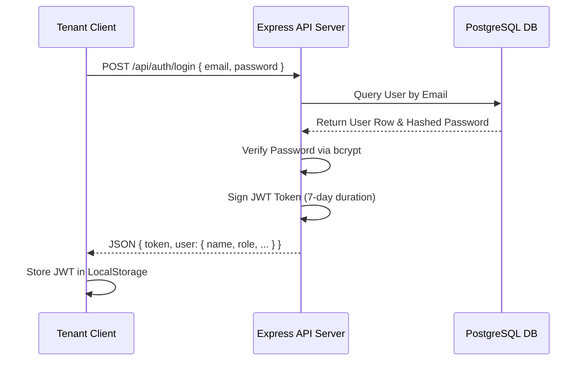
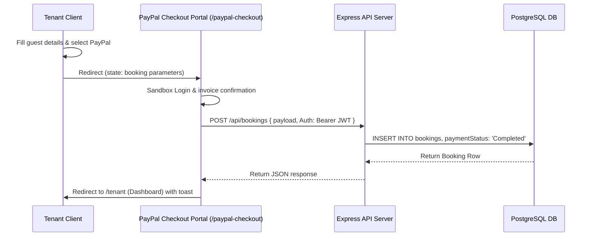
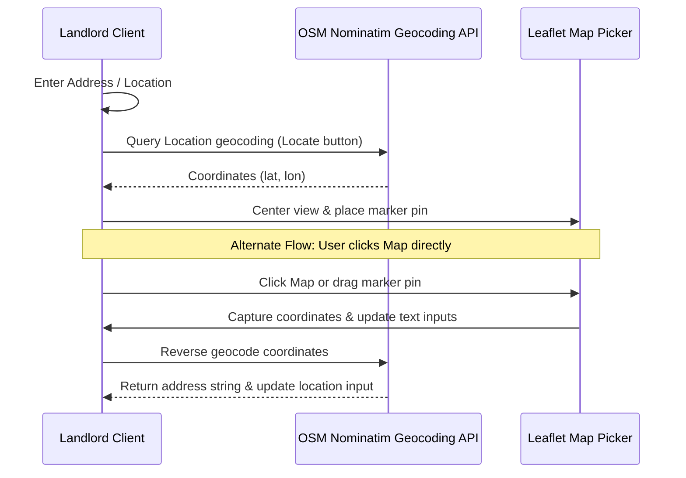

# High-Level Design (HLD) - RentEase

## 1. System Architecture
RentEase follows a decoupled client-server architecture model. The client layer runs as a Single Page Application (SPA) inside the user's browser, communicating with the server layer through asynchronous RESTful HTTP calls.

---

## 2. Technology Stack & Key Layers

### 2.1. Client Layer (Presentation)
- Serves compile-built HTML static assets via Nginx.
- Manages routing paths on the client using React Router.
- Manages map visuals dynamically using Leaflet, injecting unpkg stylesheet nodes onto the head element.

### 2.2. Gateway Server Layer (Application API)
- Serves endpoints mapping REST actions (GET, POST, PUT, DELETE).
- Encrypts user credentials using standard salt rounds (bcrypt).
- Generates base-64 signed authorization tokens (JSON Web Tokens) with a 7-day duration flag.

### 2.3. Data Persistence Layer (Database)
- Stores transactions in PostgreSQL.
- Database connections are pooled via `node-pg` client pool to limit socket overhead and handle connection drops.

---

## 3. Core Data Flow & Workflows

### 3.1. Authentication Flow

### 3.2. Booking and PayPal Redirection Flow

### 3.3. Landlord Add Listing Map Coordinate Picker Flow

